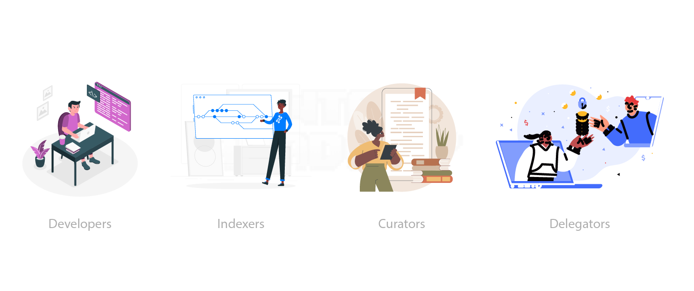

# WTF Graph minimalist tutorial: 1. Introduction

WTF Graph tutorial helps newcomers get started with using Graph quickly.

**WTF Academy Community**: [Official Website wtf.academy](https://wtf.academy) | [Discord](https://discord.gg/5akcruXrsk)

**Twitter**: [@WTFAcademy_](https://twitter.com/WTFAcademy_) | Compiled by [@Mofasasi](https://twitter.com/mofasasi)

---

# What is the Graph Network?

The Graph Network is a decentralized indexing protocol for organizing blockchain data. It makes it easier for users and developers to access and use this information to build decentralized applications. Currently, the graph is still only being used on the Ethereum blockchain. 

Projects like Bored Ape Yacht Club use advanced smart contracts on the Ethereum blockchain to manage their operations. These complex contracts generate large amounts of data that can be challenging to access and understand directly from the blockchain. With a search on blockchain explorers like [etherscan](https://etherscan.io/address/0xbc4ca0eda7647a8ab7c2061c2e118a18a936f13d#code), you can see  the basic data directly but it gets difficult to look for specific data or interpret them when found. 

# How does the Graph work?

1. Subgraphs: A subgraph is a part of the overall Ethereum or IPFS data that a Graph Node indexes. Subgraphs define which events to pay attention to in the contract, how to map and organize the data, and how to make it available for querying.

2. GraphQL API: The GraphQL API allows applications to query the indexed data in the subgraphs, making it easier to access and retrieve specific information from the blockchain.
Subgraph Manifest: The subgraph manifest is a description of the subgraph, including the smart contracts of interest, events to monitor, and how to map and organize the event data.

3. Indexing Events: As events are logged in the smart contracts, the Graph Node watches for these events, processes the data according to the subgraph manifest, and stores the indexed data in its IPFS database.

4. Querying Data: Applications can use the GraphQL API to query the indexed data in the subgraphs, making it easier to access and retrieve specific information from the blockchain.

# The Graph Network 

The Graph Network has a complex token economics model that involves four key participants: developers, indexers, curators, and delegators. The Graph's native token, GRT (Graph Token), plays a vital role in coordinating the behaviour of these participants. Here's an overview of each role and how they interact within The Graph's ecosystem

1. Developers: They create subgraphs, which are open APIs that define how to index blockchain data for easy querying. Developers use the GraphQL API to query indexed data in the subgraphs, and they pay query fees to the indexers.
  
2. Indexers: They operate nodes that process and index data from blockchains, making it easily searchable in subgraphs. Indexers earn GRT tokens for their services, and they stake GRT to provide economic security for the network.
  
3. Curators: They are subgraph developers or enthusiasts who assess the quality and usefulness of subgraphs. Curators signal on subgraphs by depositing GRT, which helps indexers identify high-quality subgraphs to index. They earn a portion of query fees for the subgraphs they signal on.

4. Delegators: They are GRT token holders who delegate their tokens to indexers to help secure the network without running a node themselves. Delegators earn a portion of query fees and indexer rewards in return for their delegation.
The Graph's token economics aim to incentivize these participants to contribute to the network's growth and security while facilitating a decentralized and scalable infrastructure for querying blockchain data.

# Summary 
