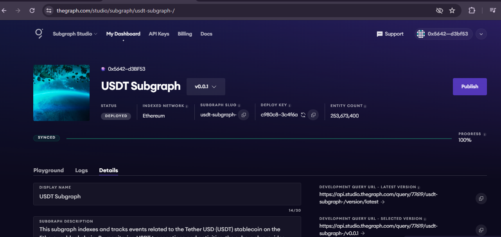
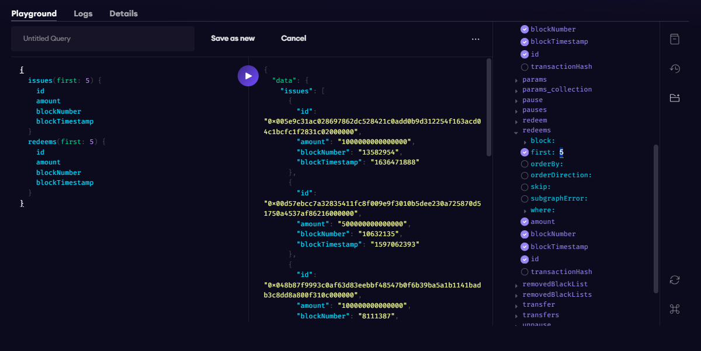

# WTF Graph minimalist tutorial: 2. Deploying Subgraph

WTF Graph tutorial helps newcomers get started with using Graph quickly.

**WTF Academy Community**: [Official Website wtf.academy](https://wtf.academy) | [Discord](https://discord.gg/5akcruXrsk)

**Twitter**: [@WTFAcademy_](https://twitter.com/WTFAcademy_) | Compiled by [@Mofasasi](https://twitter.com/mofasasi)

---

In this tutorial, we will learn how to deploy our subgraph indexes for Ethereum Mainnet on the Subgraph Studio. But before we dive into that, what is the subgraph studio and what does it help us do?

# What is Subgraph Studio?

Subgraph Studio serves as an environment where developers can build, deploy, and manage subgraphs, which are smaller, modular components of a larger GraphQL schema that define the data and events to be indexed from the blockchain.

To deploy on Subgraph Studio;

1. Go to [The Graph Studio](thegraphstudio.com/studio) and connect your wallet

2. Click "Create a Subgraph". Enter the name of the project you would like to index. For the sake of this lecture, we'll index the USDT Token. So, we name our subgraph "USDT Subgraph" and click on "create subgraph".

3.  Install the GRAPH CLI using `npm` or `yarn`

```javascript
npm install -g @graphprotocol/graph-cli
yarn global add @graphprotocol/graph-cli
```

4. Initialize the subgraph

```javascript
graph init --studio usdt-subgraph-
```

5. You will be prompted to input some details such as the protocol, ethereum network and contract address. When you input the CA, it automatically fetches the contract ABI from Etherscan.

6. It will also fetch the start block. if it doesn't, check for the start block on the blockchain explorer you're on (in this example, etherscan) and paste it and click enter.

7. You're then asked if you want to index contract events. Enter y and let the command run. This will take a few minutes as it is gathering all events that has been logged from the Tether contract and convert them into queriable entities.

8. Once it is done, you're asked if you want to run another contract. For now, click 'n'

9. Authenticate in CLI

```javascript
graph auth --studio c980c8c5fb79935fa7c87a98983c4f6a
```

10. Run the `graph codegen` & `graph build` in the directory

```javascript
graph codegen && graph build
```

11. Deploy your subgraph to subgraph studio

```javascript
graph deploy --studio usdt-subgraph-
```
At 100%, you have successfully indexed the events on Tether USDT to the subgraph studio.



**Note:**

The Graph Studio is a staging/hosting environment for indexing your project before publishing. In the home section, you can see the 'playground', 'logs' & 'details'. 

You can use the playground to fetch events easily and you will get it in real time. 

In the example below, we have queried the last 5 transactions, the amount involved in the transaction, the block number and the blockTimestamp.




We're going to cover how to publish in the next lecture. 
