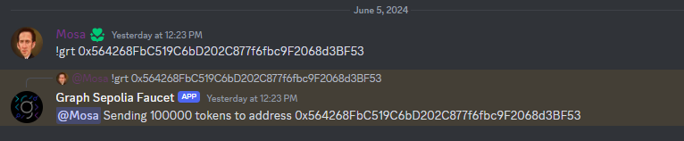
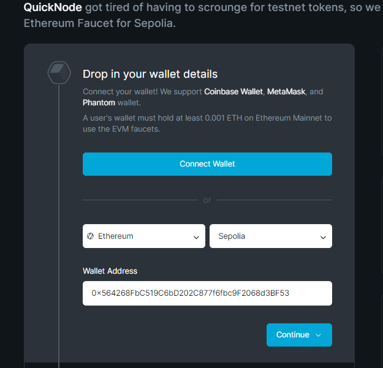
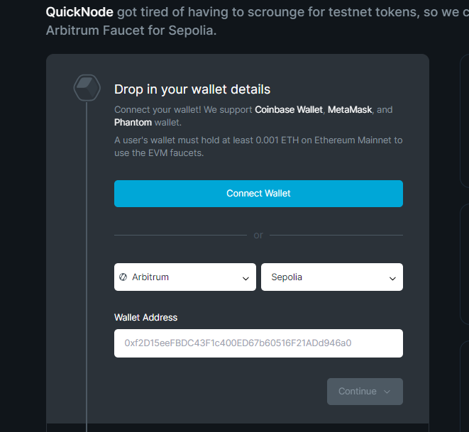
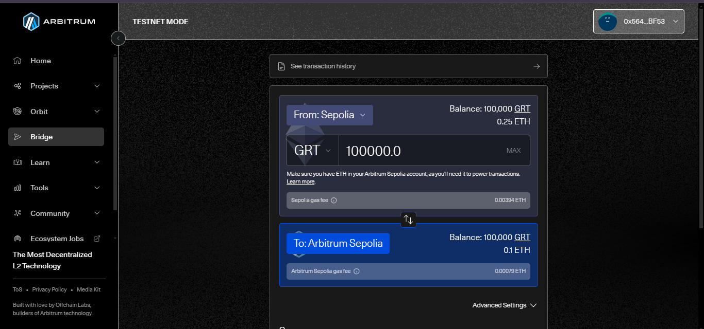
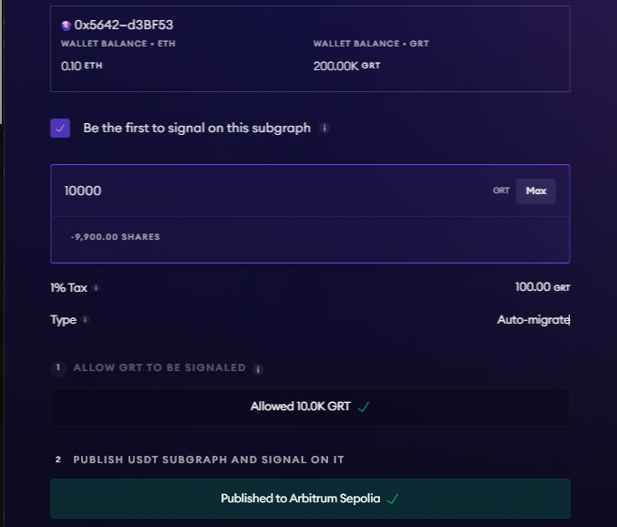
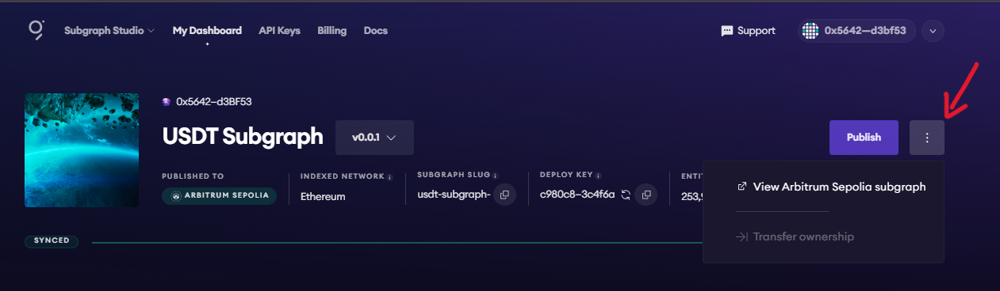
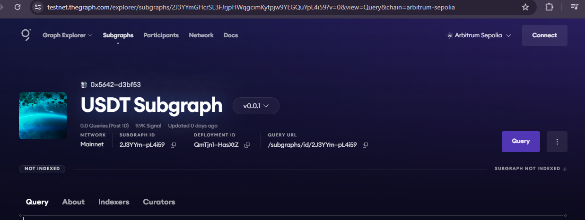

# WTF Graph minimalist tutorial: 3. Publishing Subgraph on Testnet

WTF Graph tutorial helps newcomers get started with using Graph quickly.

**WTF Academy Community**: [Official Website wtf.academy](https://wtf.academy) | [Discord](https://discord.gg/5akcruXrsk)

**Twitter**: [@WTFAcademy_](https://twitter.com/WTFAcademy_) | Compiled by [@Mofasasi](https://twitter.com/mofasasi)

---

In this lecture, we're going to build up on where we stopped in lesson 02. If you haven't deployed your subgraph in the subgraph studio, check the previous lesson and follow through because in this lecture, we will be publishing our subgraph to the Subgraph Network. 

When you hit the 'publish' button, you see the option to publish to Arbitrum One (recommended) and Arbitrum Sepolia. We will use the testnet (sepolia) to publish and get a feel of publishing subgraphs to decentralized networks before we use the Arbitrum One (mainnet).

# Steps to publish Subgraph to Arbitrum Sepolia Testnet

1. Get Ethereum Sepolia GRT from The Graph Discord

Go to the Discord > roles > choose "T" (Testnet Indexers); this gives you access to the "eth-sepolia-faucet" channel.
In the channel, type "!grt(space)followedByYourWalletAddress" e.g !grt 0x564268FbC519C6bD202C877f6fbc9F2068d3BF53

2. Get Ethereum Sepolia Eth from a faucet

You can use chainlist or Quicknode to get free Eth for gas. Although, Quicknode requires you to have a balance of 0.001ETH in your mainnet, chainlist offers you free (1 request every 12 hours)

3. Get Arbitrum Sepolia Eth from a faucet

Same logic as (2) above. Just change the chain from Ethereum to Arbitrum

4. Bridge Ethereum Sepolia GRT to Arbitrum via [Arbitrum Bridge](https://bridge.arbitrum.io/?destinationChain=arbitrum-sepolia&sourceChain=sepolia)

5. Publish your subgraph

When you're done bridging, head back to your deployed index on the Graph Studio and click publish to "Arbitum Sepolia". The 10K GRT signalling fee tells the indexers that it is a priority and it gets you indexed faster, and you also receive some indexing rewards. 

After you input the 10,000, sign the transaction and publish. Once it is successful, hit the indicated place in the image below to see your published subgraph on the Graph network using Arbitrum Sepolia GRT. 

Note: The testnet publication is not indexed. Publications only get indexed on the mainnet. We will cover that in the next lecture.

# Summary 

In this lecture, we see a step-by-step guide on how to publish subgraphs on testnet. 
