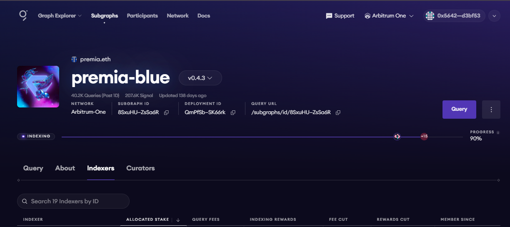

# WTF Graph minimalist tutorial: 4. Publishing Subgraph on Mainnet

WTF Graph tutorial helps newcomers get started with using Graph quickly.

**WTF Academy Community**: [Official Website wtf.academy](https://wtf.academy) | [Discord](https://discord.gg/5akcruXrsk)

**Twitter**: [@WTFAcademy_](https://twitter.com/WTFAcademy_) | Compiled by [@Mofasasi](https://twitter.com/mofasasi)

---

In this lecture, we're going to publish our subgraph to the Arbitrum mainnet (also called Arbitrum One).

This process is very similar to publishing on Testnet, the only difference is that we will be using real ETH and real GRT for this publication.

# Steps to publish Subgraph to Arbitrum One

1. Fund your wallet address with some ETH
    
2. Swap the ETH for GRT via [Uniswap](https://app.uniswap.org/swap?chain=arbitrum) 

3. After swapping, bridge your GRT to Arbitrum via [Arbitrum Bridge](https://bridge.arbitrum.io/?destinationChain=arbitrum-one&sourceChain=ethereum)

4. Publish your subgraph

When you're done bridging, head back to your deployed index on the Graph Studio and click publish to "Arbitum One". Ensure you signal the 10k GRT

After publishing your subgraph, head over to the Graph Explorer, and click "Arbitrum One", you'll find your published subgraph there.  

 

In the example image above, you can see that this project is "indexing" because it is on the mainnet. Also, you can find the number of indexers and curators active on the project. 

# Summary

In this lecture, we see a step-by-step guide on how to publish subgraphs to mainnet (Arbitrum One).
