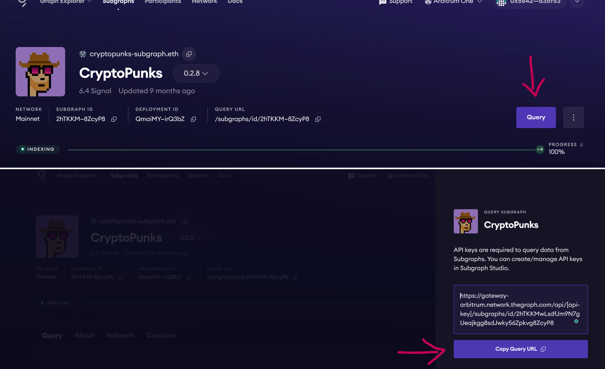
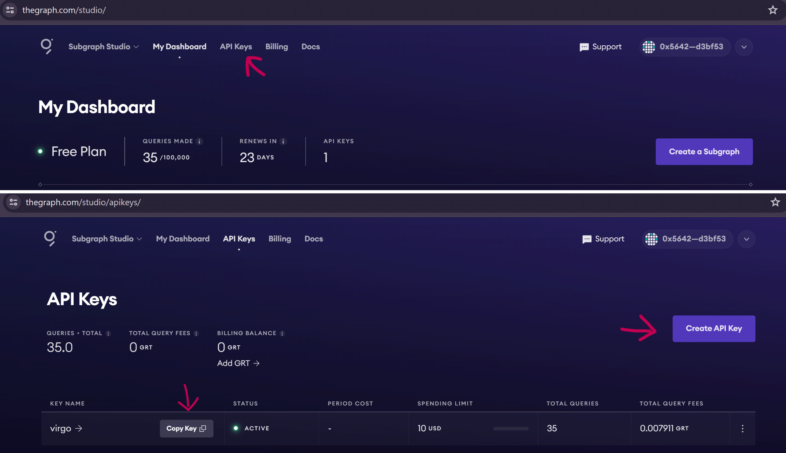

# WTF Graph minimalist tutorial: 5. Querying a Subgraph

WTF Graph tutorial helps newcomers get started with using Graph quickly.

**WTF Academy Community**: [Official Website wtf.academy](https://wtf.academy) | [Discord](https://discord.gg/5akcruXrsk)

**Twitter**: [@WTFAcademy_](https://twitter.com/WTFAcademy_) | Compiled by [@Mofasasi](https://twitter.com/mofasasi)

---
In this lecture, we will examine how to query a subgraph from the graph studio/explorer using the GraphQL API

Projects that use The Graph as an indexing tool deploy their subgraph on the Graph Explorer and developers can fetch data from their subgraphs using the GraphQL API. 

There are 3 GraphQL clients that can achieve this goal;
1. Graph client
2. Apollo client
3. URQL

For the sake of this tutorial, we will query a subgraph using URQL because:
- it is a very flexible system
- it is the least heavy bundle (~5x lighter than others)
- it is easier to build new capabilities on it.

# Querying a Subgraph using URQL 

Ideally, you'll need to query a subgraph to fetch data to a front-end application, but if you don't have an active project, that's okay. 

You can create a test react project and continue below:

1. Install `urql` and `graphql`:
```
npm install urql graphql
```

2. In your react project, pass the API with the following code:

```
import React, { useState, useEffect } from 'react';
import './App.css';
import { createClient, cacheExchange, fetchExchange, gql } from '@urql/core';

const client = createClient({
  url: 'https://gateway-arbitrum.network.thegraph.com/api/[api-key]/subgraphs/id/2hTKKMwLsdfJm9N7gUeajkgg8sdJwky56Zpkvg8ZcyP8',
  exchanges: [cacheExchange, fetchExchange],
});

const query = gql`
your query goes in here`
```

3. Every subgraph on the Graph studio has a GraphQL endpoint as used in (2) above.

When you find the subgraph you want to query, open it and click on query, copy the link and pass it as the `url`

 

To get the API key, you need to sign in to the graph studio, locate the API section, and then create an API key.

If you already have one, don't forget to copy and substitute it for the `api-key` in the endpoint. if not, you'd keep getting error messages. 

 


